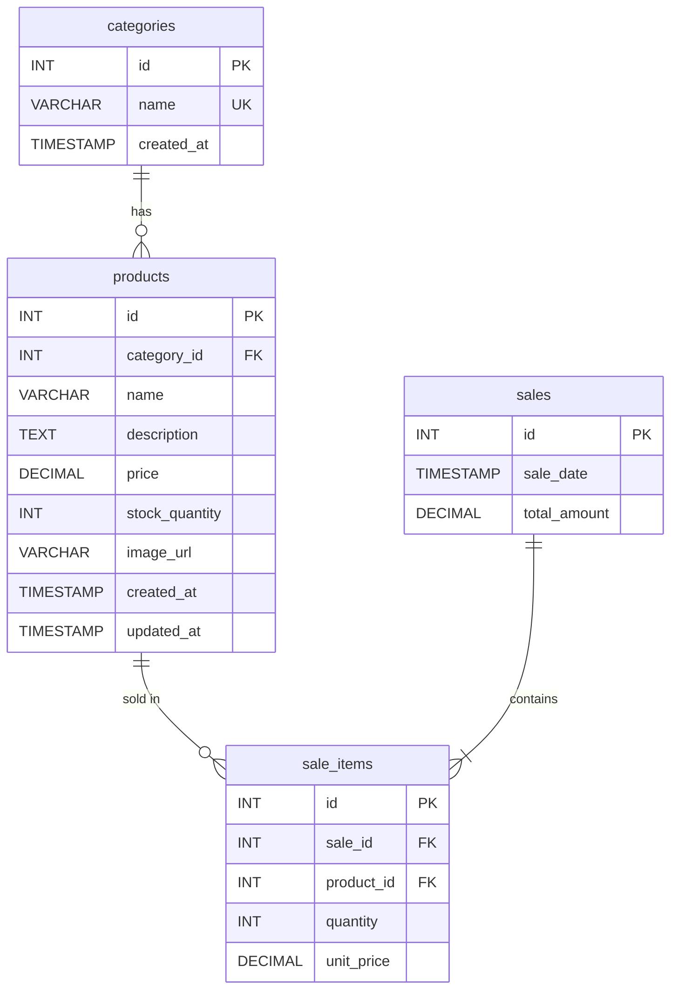
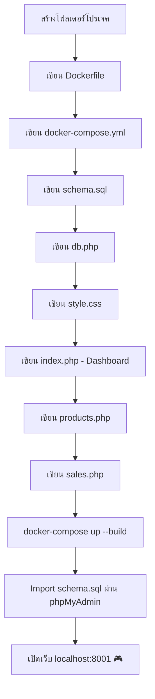

# 📊 วิเคราะห์โปรเจค: Gaming Store Inventory System

## 🔍 ภาพรวมโปรเจค

ระบบจัดการสต็อกสินค้าร้านขายอุปกรณ์เกมมิ่ง (Gaming Store) พัฒนาด้วย **PHP + MariaDB** รันผ่าน **Docker** มี Dashboard สรุปข้อมูล, หน้าจัดการสินค้า (CRUD), และหน้าขายสินค้า ธีม Dark Mode สไตล์โมเดิร์น

---

## 📁 โครงสร้างไฟล์

```
pretest-gamingstore-99/
├── Dockerfile              # สร้าง PHP 8.2 Apache image พร้อม extension MySQLi/PDO
├── docker-compose.yml      # จัดการ 3 services: PHP, MariaDB, phpMyAdmin
├── db.php                  # เชื่อมต่อฐานข้อมูลผ่าน PDO
├── index.php               # หน้า Dashboard (สรุปสถิติ + ยอดขายล่าสุด)
├── products.php            # หน้าจัดการสินค้า (เพิ่ม/ลบ/แสดงรายการ)
├── sales.php               # หน้าขายสินค้า (ยังไม่ได้สร้าง - มีลิงก์อ้างอิงแล้ว)
├── schema.sql              # SQL สร้างตาราง + ข้อมูลเริ่มต้น
├── assets/
│   └── css/
│       └── style.css       # Dark theme CSS (Inter font, glow effects)
└── README.md               # ไฟล์อธิบายโปรเจค (มีแค่ชื่อ)
```

---

## 🛠️ เทคโนโลยีที่ใช้

| เทคโนโลยี | เวอร์ชัน | หน้าที่ |
|---|---|---|
| PHP | 8.2 | Backend + Server-side rendering |
| MariaDB | 10.6 | ฐานข้อมูล |
| Apache | (มาพร้อม PHP image) | Web server |
| Docker Compose | 3.8 | จัดการ containers |
| phpMyAdmin | latest | จัดการฐานข้อมูลผ่าน GUI |
| PDO | - | เชื่อมต่อ DB (Prepared statements) |
| CSS Variables | - | Design system (Dark theme) |

---

## 🗄️ Database Schema (4 ตาราง)



**หมวดหมู่เริ่มต้น:** Graphics Cards, Processors, RAM, Storage, Monitors, Peripherals

---

## 🌐 Docker Services & Ports

| Service | Container Name | Port (Host → Container) |
|---|---|---|
| PHP Apache | `stock_php_99` | `8001 → 80` |
| MariaDB | `stock_db_99` | Internal only |
| phpMyAdmin | `stock_pma_99` | `8080 → 80` |

**Network:** `app-network` (bridge driver)  
**Volume:** `db_data` สำหรับเก็บข้อมูล MariaDB

---

## 🎨 Design System

- **Theme:** Dark Mode (`#0f172a` พื้นหลัง, `#1e293b` การ์ด)
- **Accent:** Sky blue `#38bdf8` พร้อม glow effect
- **Font:** Inter (system-ui fallback)
- **Layout:** Sidebar 260px + Main content (Flexbox)
- **Cards:** Hover animation (`translateY(-5px)` + border glow)
- **สี Status:** Success `#22c55e` / Danger `#ef4444`

---

## 📄 หน้าเว็บที่มี

### 1. Dashboard (`index.php`)
- แสดง 3 stat cards: จำนวนสินค้าทั้งหมด, สินค้า stock ต่ำ (<5), ยอดขายรวม (฿)
- ตาราง Recent Sales (5 รายการล่าสุด)
- Sidebar navigation (Dashboard, Products, Sales)

### 2. Products (`products.php`)
- ตารางแสดงสินค้าทั้งหมด (ID, ชื่อ, หมวดหมู่, ราคา, stock)
- ปุ่มลบสินค้า (มี confirm dialog)
- Modal เพิ่มสินค้าใหม่ (ชื่อ, หมวดหมู่, ราคา, stock)
- สีเตือน stock ต่ำ (<5 ชิ้น)

### 3. Sales (`sales.php`) — ⚠️ ยังไม่ได้สร้าง
- มีลิงก์อ้างอิงจาก index.php และ products.php แล้ว

---

## ⚠️ สิ่งที่ยังขาด / ควรพัฒนาเพิ่ม

1. **`sales.php`** — ยังไม่ได้สร้าง (CRUD สำหรับการขาย)
2. **Edit Product** — มีแค่ Add/Delete ยังไม่มี Edit
3. **Schema Import** — `schema.sql` ไม่ได้ mount เข้า Docker auto-init
4. **Authentication** — ไม่มีระบบ Login/Logout
5. **Input Validation** — ฝั่ง server มีน้อย
6. **SQL Injection** — `delete` ใน products.php ใช้ prepared statement แล้ว ✅
7. **XSS Protection** — ใช้ `htmlspecialchars()` แล้วบางส่วน ✅
8. **Responsive Design** — CSS ยังไม่รองรับ mobile เต็มที่

---

---

# 🤖 Prompt สำหรับสร้างโปรเจคนี้ใหม่

> ใช้ prompt นี้กับ AI เพื่อสร้างโปรเจคที่มีโครงสร้าง/ฟีเจอร์เหมือนกัน

```
สร้างเว็บแอป "Gaming Store Inventory System" ด้วย PHP 8.2 + MariaDB 10.6 + Docker Compose

ข้อกำหนด:
1. ใช้ Docker Compose จัดการ 3 services:
   - PHP 8.2 Apache (port 8001) พร้อม extension mysqli, pdo, pdo_mysql
   - MariaDB 10.6 (database: gaming_store, user: user, password: password)
   - phpMyAdmin (port 8080)

2. ฐานข้อมูล 4 ตาราง:
   - categories (id, name, created_at) — ข้อมูลเริ่มต้น: Graphics Cards, Processors, RAM, Storage, Monitors, Peripherals
   - products (id, category_id FK, name, description, price, stock_quantity, image_url, created_at, updated_at)
   - sales (id, sale_date, total_amount)
   - sale_items (id, sale_id FK, product_id FK, quantity, unit_price)

3. หน้าเว็บ:
   - Dashboard (index.php): แสดงสถิติ (จำนวนสินค้า, stock ต่ำ, ยอดขายรวม) + ตาราง 5 ยอดขายล่าสุด
   - Products (products.php): CRUD สินค้า (เพิ่ม/ลบ/แสดงรายการ) พร้อม modal form
   - Sales (sales.php): จัดการการขาย

4. Design:
   - Dark theme (พื้น #0f172a, การ์ด #1e293b, accent #38bdf8)
   - Sidebar navigation 260px
   - Font: Inter
   - Cards มี hover animation
   - สีเตือน stock ต่ำ (<5) เป็นสีแดง
   - ราคาแสดงเป็นสกุลเงินบาท (฿)

5. เชื่อมต่อ DB ด้วย PDO + Prepared Statements
6. ใช้ htmlspecialchars() ป้องกัน XSS
```

---

---

# 📝 สรุปขั้นตอนการเริ่มสร้างโปรเจค (Step-by-Step)

## ขั้นตอนที่ 1: สร้างโครงสร้างโฟลเดอร์

```bash
mkdir pretest-gamingstore-99
cd pretest-gamingstore-99
mkdir -p assets/css
```

---

## ขั้นตอนที่ 2: สร้าง Dockerfile

สร้างไฟล์ `Dockerfile` สำหรับ PHP 8.2 Apache image พร้อมติดตั้ง extension ที่จำเป็น

```dockerfile
FROM php:8.2-apache
RUN docker-php-ext-install mysqli pdo pdo_mysql && docker-php-ext-enable mysqli pdo_mysql
EXPOSE 80
```

---

## ขั้นตอนที่ 3: สร้าง docker-compose.yml

กำหนด 3 services ที่ทำงานร่วมกัน:

- **php** — Build จาก Dockerfile, map port `8001:80`, mount โค้ดเข้า `/var/www/html`
- **db** — MariaDB 10.6, ตั้งค่า database/user/password
- **phpmyadmin** — เข้าผ่าน port `8080`, เชื่อมกับ db

> ทุก service อยู่ใน network `app-network` เดียวกัน, ใช้ volume `db_data` เก็บข้อมูล

---

## ขั้นตอนที่ 4: สร้าง Database Schema (`schema.sql`)

เขียน SQL สำหรับ:
1. สร้าง database `gaming_store`
2. สร้าง 4 ตาราง: `categories`, `products`, `sales`, `sale_items`
3. กำหนด Foreign Key relationships
4. Insert ข้อมูลหมวดหมู่เริ่มต้น 6 รายการ

> **TIP:** หลังจากรัน Docker ครั้งแรก ให้ import `schema.sql` ผ่าน phpMyAdmin ที่ `localhost:8080`

---

## ขั้นตอนที่ 5: สร้างไฟล์เชื่อมต่อฐานข้อมูล (`db.php`)

- ใช้ PDO เชื่อมต่อ MariaDB
- ตั้งค่า: `ERRMODE_EXCEPTION`, `FETCH_ASSOC`, `EMULATE_PREPARES = false`
- Host = ชื่อ container ของ DB (`stock_db_99`)

---

## ขั้นตอนที่ 6: สร้าง CSS Design System (`assets/css/style.css`)

กำหนด:
- CSS Variables สำหรับ Dark theme
- Layout: Sidebar + Main content (Flexbox)
- Component styles: Cards, Tables, Buttons, Forms, Modal
- Hover animations + Glow effects

---

## ขั้นตอนที่ 7: สร้างหน้า Dashboard (`index.php`)

1. `require_once 'db.php'` เพื่อเชื่อมต่อ DB
2. Query สถิติ: จำนวนสินค้า, สินค้า stock ต่ำ, ยอดขายรวม
3. Query 5 ยอดขายล่าสุด
4. แสดง Sidebar + stat cards 3 ใบ + ตาราง Recent Sales

---

## ขั้นตอนที่ 8: สร้างหน้า Products (`products.php`)

1. Handle DELETE (GET parameter `?delete=id`)
2. Handle ADD (POST form submit)
3. Query หมวดหมู่ทั้งหมด + สินค้าทั้งหมด (JOIN categories)
4. แสดงตารางสินค้า พร้อมปุ่มลบ
5. สร้าง Modal form สำหรับเพิ่มสินค้าใหม่

---

## ขั้นตอนที่ 9: สร้างหน้า Sales (`sales.php`) — *ยังไม่ได้ทำ*

ควรมีฟีเจอร์:
- เลือกสินค้าที่จะขาย + กำหนดจำนวน
- บันทึกรายการขายลงตาราง `sales` + `sale_items`
- หักจำนวน stock จากตาราง `products`
- แสดงประวัติการขายทั้งหมด

---

## ขั้นตอนที่ 10: รันโปรเจค

```bash
# 1. Build และรัน Docker containers
docker-compose up -d --build

# 2. เปิด phpMyAdmin เพื่อ import schema
# เข้า http://localhost:8080
# Login: root / rootpassword
# Import schema.sql

# 3. เปิดเว็บแอป
# เข้า http://localhost:8001
```

---

## 📌 สรุป Flow การทำงาน


